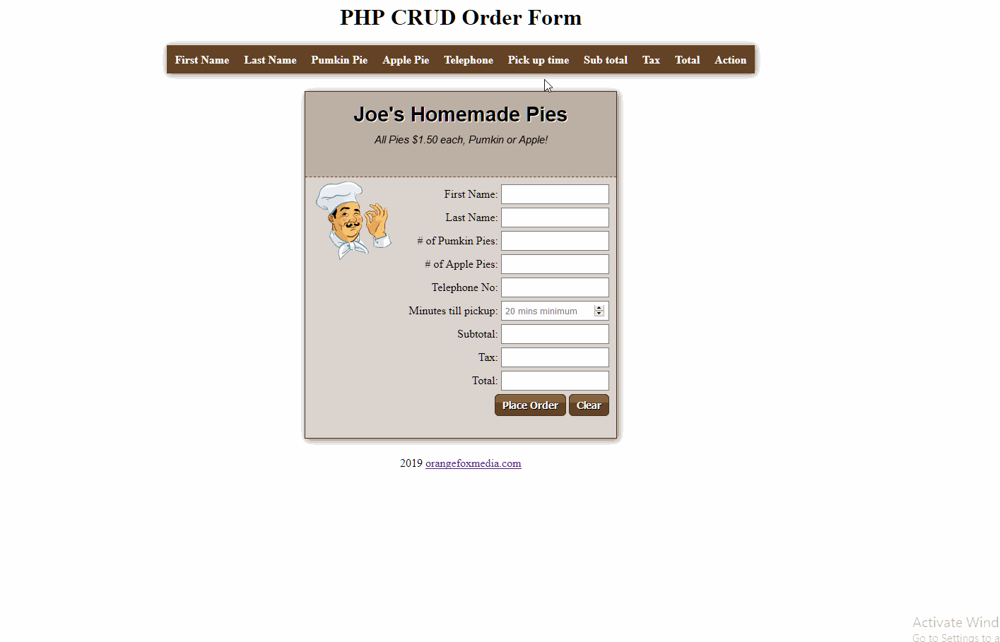

This project is a CRUD application build with HTML,CSS, Javascript and PHP. 

The user enter information in the form and the form will dynamically compute the price of the items, send the data to the database.

The administrator of the system can now create, read, update or delete records from the database.

See demo:

